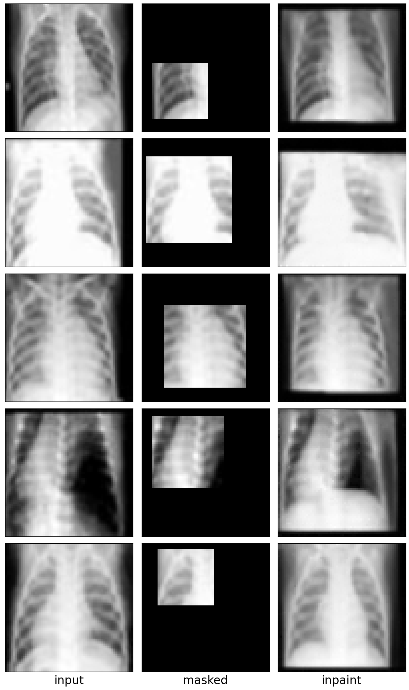

# DDIM-based Synthetic Medical Image Augmentation for increased CNN Performance in COVID-19 Classification

The project has been developed for the "Generative Deep Learning" course of Prof. Danilo Comminiello, A.Y. 2021-2022.

**AUTHORS**

Simone Rossetti, Roma, December 2022

**ABSTRACT**

Large-scale annotated datasets have proven to empower deep neural networks. However, obtaining large annotated datasets is challenging in many domains. The medical domain is one such area where labelling requires expertise, therefore annotating a large number of data is highly expensive and time-consuming but most of all inefficient in a pandemic scenario. We address the stated critical issue with the help of generative models.  We demonstrate that DMs (Diffusion Models), can be used to generate synthetic augmented medical images even when trained with a small number of available real images, as well as GANs (Generative Adversarial Networks). From the experiments, we observe an increase in classification accuracy, sensitivity and specificity.

*Interpolation*

*Inpainting*

**DATASET**

COVID-19 X-rays chest scans images, 4 classes classification task:

more about dataset source [here](https://github.com/ieee8023/covid-chestxray-dataset).

**DOCUMENTATION**: 

more informations about the work done [here](/report.pdf).
 
